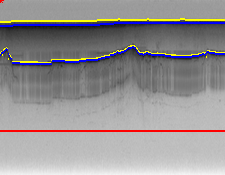
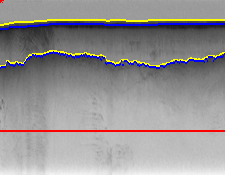
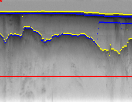

# **Assignment 3**
Completed by: McKenzie Quinn (mckquinn@iu.edu), Brad Cooley (bwcooley@iu.edu), and John Holt (holtjohn@iu.edu)

### _Opening Remarks_

This project consisted of three parts found in this [project description document](/a3-fa21.pdf) with our group's implementation documented in a report-style format below.

_The code in this project is not perfect and optimizations can always be found. I would love to have a discussion about potential optimizations! Feel free to contact me (Brad Cooley) at my IU email above._

## **Part 1: Part-of-speech tagging**
_Implemented by McKenzie Quinn_

### _Overview and Approach_

In determining how to solve this problem, I decided to start with the simple bayes net to get the initial emission probabilities. Ths simple bayes net was also easier to understand since we are using simple probabilities and are not too concerned with transitional probabilities. This also gives me a chance to understand what the skeleton code is doing and how to best use it. Within my solver class, I initialize a few different variables to keep track of counts, probabilities and the tags we had to use in our evaluation.  

Since the text data looked pretty clean to begin with, I decided not to do any text preprocessing. A way to possibly improve this model would be take lemmas of the words and then calculate probabilities, but I ran out of time for that. For all parts of this problem, whenever a probability could not be found in the training data, I used the value of .0000001 as the place holder. This ensures our probabilities don't 0 out. Since we are working with potentially small variables, all calculations utilized logs.

### _Challenges_

- In implementing the Viterbi algorithm and MCMC portions of this assignment it was easy to lose track of where in the algorithm, making it challenging to build out especially with all the moving parts within the two algorithms.
- I struggled to get my model to perform  within the 10 minute time allotment. I went through my code multiple times to change for loops into list and dictionary comprehensions whenever possible, even changed some architecture of the code to improve testing performance. I know my model trains in under 3 seconds and both my Viterbi algorithm and simple model predict in under a second. My MCMC model can take up to 3 seconds to run for longer sentences, however I am struggling to find ways to trim down my code to run faster. Overall I feel as though I have an understanding of these modeling concepts but the software engineering aspects of optimizations have proven difficult.

### _Accuracy_
While my code won't finish with the 10 minutes, probably closer to 30, my model was pretty accurate! The following are the accuracies I got:

- Simple: 93.96%   words correct   47.5%  sentences correct
- HMM:    95.07% words correct     54.5% sentences correct
- Complex:  94.6%  words correct    51.3% sentences correct

## **Part 2: Ice tracking**
_Implemented by Brad Cooley_

### _Part A_
Part A took me a while to understand because I couldn't comprehend how to apply a simple approach to a complex problem. I went to office hours and realized it all had to do with my emission probabilities and the fact that the simple version of the algorithm didn't need to perform that well. I ended up creating a simple Bayes net that used the `edge_strength` to calculate the emission probabilities. To make the model perform a little bit better, I looked for points within a fixed tolerance to make sure they weren't bogus values or something of that nature.

### _Part B_
Part B was the hardest one for me. Mainly because I had such a hard time trying to get a good grasp on Viterbi and get a good understanding of how to apply the algorithm to this situation. The results? Uh, well, not horribly on some images like the two below:
 

However, when major shifts in the terrain happened, the algorithm performed quite poorly as seen in this image:

I'm not sure the reason for this happening, but I think it stems from the lack of backtracking in my algorithm, and my lack of fully understanding Viterbi.

My approach was to generate my initials using the `edge_strength` and then from there calculate the transitions for each subsequent column using a normal distribution with a mean of the row value and a standard deviation of 5 (that way 2 standard deviations away would be roughly 10 pixels). This worked in theory, but didn't translate too well to implementation as the model fell short in some areas.

### _Part C_
Part C was not attempted because I couldn't get Part B working properly. However, I do understand that Part C was really a test of if our Viterbi implemented backtracking properly. If it was not implemented properly, the boundary lines would look a little rough on one side or the other of the asterisk. I am going to try to fix my algorithm and turn in this assignment late as I think it would greatly help our score and (hopefully) my understanding of the material that is sure to be on the final :).

## **Part 3: Reading text**

_Implemented by John Holt_

### _Overview and General Implementation_

I chose to make the best possible simple model I could, and then use the Viterbi algorithm to pick the best choice (based on training data) of the most probable 3 options from the simple model. The simple model selects the training letter with the highest probability given the corresponding character from the image. The HMM improves upon this by including transition probabilities from each digit to the next based on training data.

How it Works:

- Training data is thoroughly "cleaned" in the following ways:
  - Only one instance of each word is allowed
  - Punctuation is removed
  - Capitalization is removed
- Initials list is created representing the initial probability of any given letter
  - If initial probability is zero, it is assigned the minimum of all other initials
- Transitions list is created representing the transitions from any digit i to digit j
  - accessible by referencing index ix46+j
  - transitions from upper case letters are defined to be identical to those from lower
  - transitions from any number to any other number are all the same
- Image is scanned to determine "noise", which is a relative comparison of average pixels per character to that of training set
- Each image is assigned a threshold value (to which all lower emission probabilities for a given character result in a blank space determination)
  - threshold value scales based on noise
- Emission probabilities are defined to be (number of matching asterisks)/(number of matching asterisks + number of asterisks unique to train or test letter)
- Viterbi runs through each character to find most likely chain of letters

### _Challenges_

The Viterbi algorithm worked exactly as planned. Unfortunately, transitional probabilities from one letter to the next are not in themselves a great representation of language. Other (more important) factors are in play, such as whether or not a string is a true word. For instance:

- " se " will always be more likely than " so ", since all things equal, e ends more words than o and e follows s more often than o
- This makes some short words, like "so", "of", "in", etc. very challenging to produce using a HMM, irrespective of how good the simple model works
- This leads to a constant tradeoff between how influential of a role you want the transitional probabilities to play
  - too high leads to making errors where the simple model did not
  - too low leads to being unable to fix the errors made by the simple model

### _Implementation Design Choices_

- The "space" character was treated differently that the rest
  - Since emission probabilities were based on asterisks and not white space, the space became an assigned value given insufficient probabilities (below threshold)
- I exponentiated my emission probabilities to give them more influence versus the transition probabilities
  - The separation in probabilities that resulted greatly reduced the influence of unlikely characters taking over given biased transitional probabilities
  - This resulted in better results in the face of heavily biased data
- For any given character, the best three emissions are kept, and the rest are turned to 0
  - As before, this helped prevent unlikely characters from being selected due to favorable transitional probabilities
  - The simple model was good enough to get a correct character within the top three irrespective of the noise