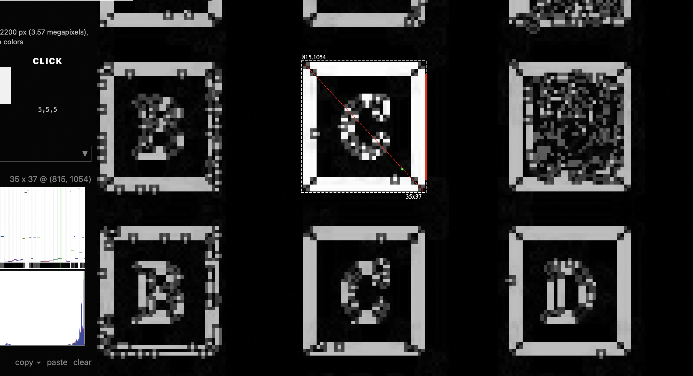
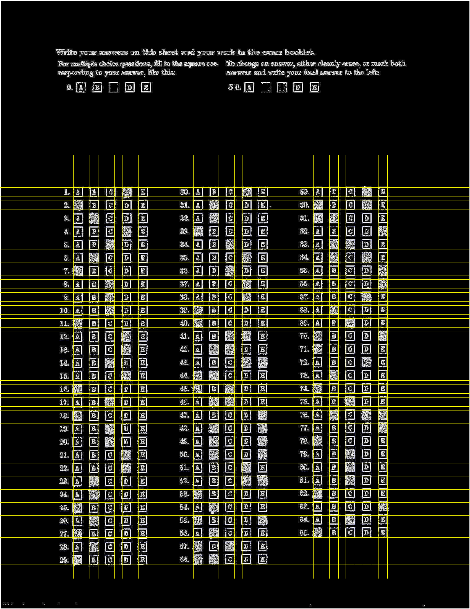
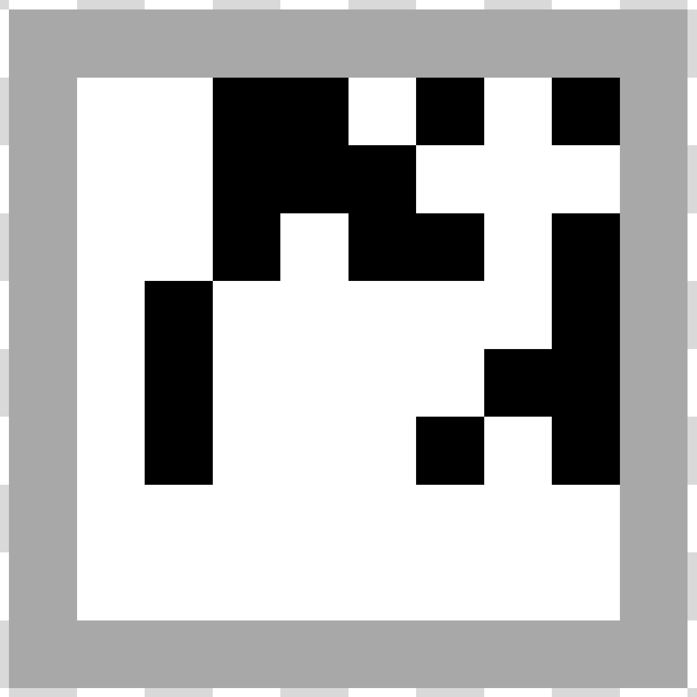
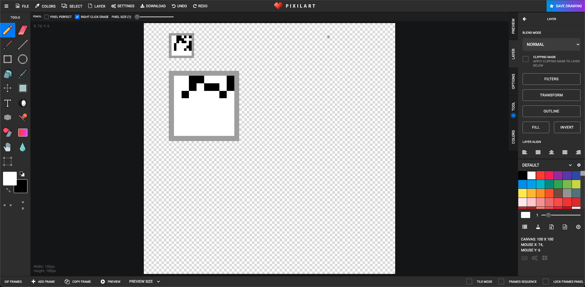
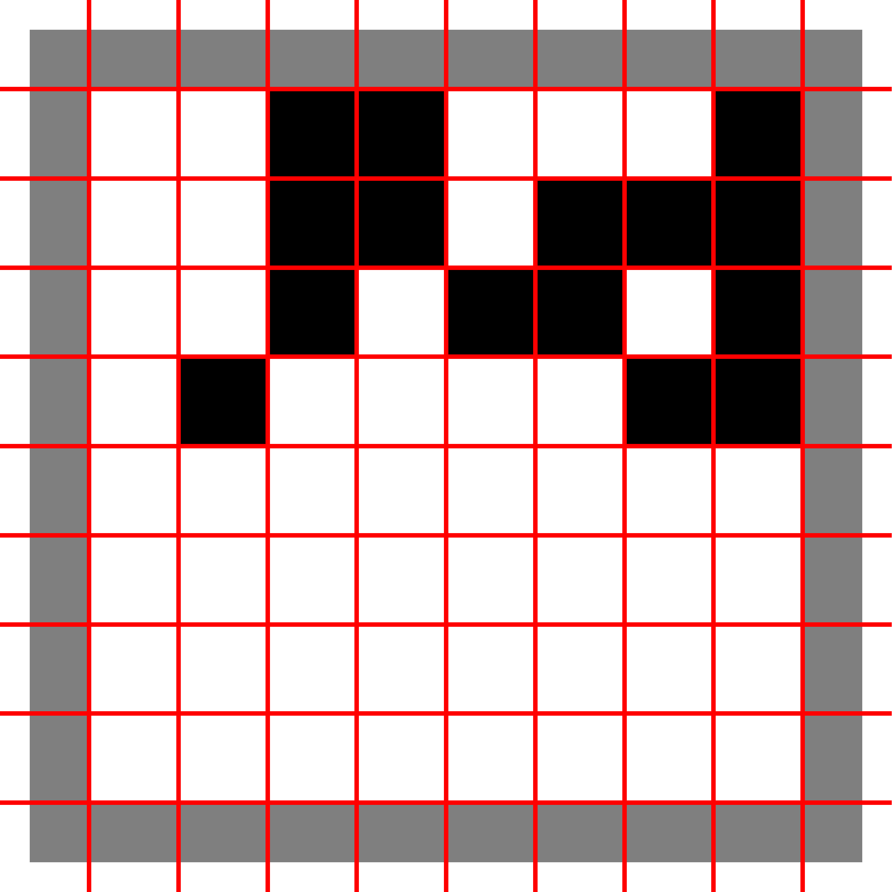
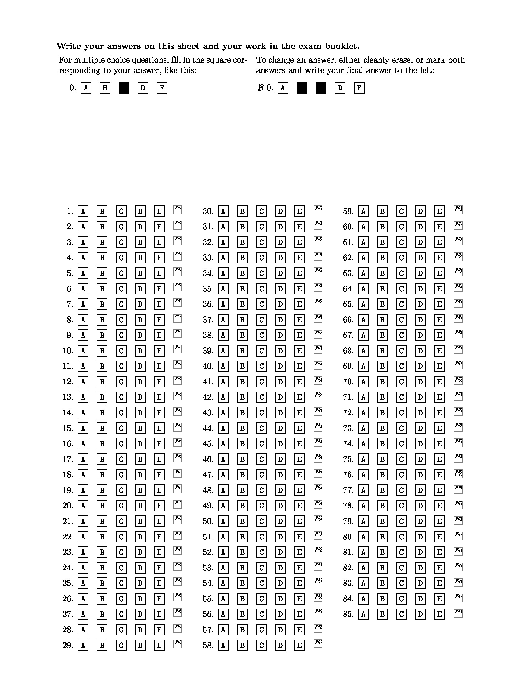

# **Assignment 1: Image Processing and Recognition Basics**
Completed by: Brad Cooley (bwcooley@iu.edu), Rishi Raj (risraj@iu.edu), and Kowshik Selvam (kselvam@iu.edu)

### _Opening Remarks_

This project consisted of three parts found in this [project description document](/a1.pdf) with our group's implementation documented in a report-style format below.

_The code in this project is not perfect and optimizations can always be found. I would love to have a discussion about potential optimizations! Feel free to contact me (Brad Cooley) at my IU email above._

## **Task 1: Extracting the Answers that Students have marked in Answer Sheet**
_This part was designed and implemented by Kowshik Selvam_

### _Part 1 : Brainstorming_

When I read the question for the task to extract the answers that the students have marked in the answer sheet, I straight away started thinking of various techniques using which I could find the boundaries of the Answer options (A, B, C, D, E) for each question. Since all the answer option in the answer sheet should follow a straight line, as in all the starting and ending line of the answer option box should fall in a straight line, I first thought of ways to get the straight lines along the boxes. Then once I get all the straight lines, I thought of extracting the correct option marked from the boxes which are covered by the lines. 

#### _Idea 1:_

The first idea that I implemented for Hough Transform. I did non maximum suppression to makes sure it forms only one line instead of various lines coupling together at a single point ( in our case the horizontal and vertical line of the box. Then I implemented Hough transform from scratch and first it took 19 min to give few lines along the answer options. It gave somewhat good result but it took a lot of time. So I tried optimizing the code to check for lines in only desired places and then I managed to get lines along horizontally and vertically in 7 min but the result was not quite good as there were many overlapping lines and I was not able to get any useful insights from the lines to further develop on it. I performed various pre processing on the image to get the lines by performing hough transform but I was able to get the desired output.

#### _Idea 2:_

Since I believed obtaining lines was one of the easiest and computationally faster way to extract the answers marked by students, I started to brainstorm on various possibilities to get the lines around the boxes. I assumed since this answer sheet would be distributed among the students for them to mark, the lines of the boxes should almost follow 90 degrees (not perfect 90 but almost a 90), I thought of calculating the edge strength along the horizontal axis and vertical axis to get the boundary of the boxes.

### _Development on Idea 2:_

First I did edge detection on the image to get brighter box boundaries. I used sobel filter to perform the edge detection and multiplied the edge value by 10. Then I calculated the pixel value along every row and column. Since we assumed the answer boxes to follow almost a straight + or - 90 degree scale, obviously we can say that the rows and columns having the answer box pixels will be the highest because we performed edge detection to detect the edges which makes it brighter. Then I sorted the horizontal and vertical lines with the highest pixel sum value in decreasing. From this by neglecting close lines I formed all the vertical lines around the box lines as we know the lines along the box lines will be having the highest pixel sum value. Now taking these vertical lines as reference I found the rest of the horizontal lines around the boxes.

As seen from the above image I approximated the dimension of the answer box to plot the lines. Now after finding the horizontal and vertical lines for the image that represents the boundary of the boxes, I couple the horizontal and vertical lines to found the coordinates of the intersection points and plotted to lines to check if it is along the boundary of the answer boxes.

This below image with the line boundaries will be shown while running the program.

From the above image we can see the lines formed by the predicted lines. Since it’s along the boundary of the boxes now we can loop through each intersecting coordinates to find the frame which we need to parse to get the answer.

Now in the original image these coordinate points of the boxes are used to get the answer box frame and a threshold is given to count the pixel sum lesser than some range. This way I predicted the correct answer from the boxes. Same way to obtain anything that is written by the student near to the question number a separate frame is used along a threshold value and if the sum of pixel value is below a range in the frame then it is considered to be “x” in the output file.

As a result the extracted answers are appended in a text file along with the question number and “x” if some other answer is marked by the student near the question number.

### _Shortcomings_

Though the above logic works most of the times correctly on images with answer boxes, if the boxes are very much slanting, that is if the pixel doesn’t follow almost 90 degrees for the lines along the boxes then the logic may not work that properly but still it should do some descent job. I carried out this particular logical implementation just because just type of answer sheet will always follow a straight line.

The outputs are accurate to all the files except for the a-27.png file as the thresholds needs to be modified to make it more accurate to work with a-27.png which can be done by pixel level calculation to make it robust across all the images.

## **Task 2: Correct Answer Encoding**
_This part was designed and implemented by Brad Cooley_

### _Part 1: Brainstorming_

Trying to figure out how to best encode the answers for the questions on the question sheet without a student reading them didn't seem like an overly difficult task at first. My mind immediately went to creating a QR code and placing it in the empty space below the 85th question. However, [after clarification on the problem](https://inscribe.education/main/indianau/6754110229501742/conversations/6749461749700332?searchText=barcode&backToListTab=search), it was revealed we would have to implement the QR code from scratch. Originally, this didn't sound overly difficult, but after watching a [video](https://www.youtube.com/watch?v=142TGhaTMtI) on how these barcodes are made, it seemed like overkill for this assignment. It also occurred to me that a simple QR code could be read by a student with a smartphone, therefore compromising the answers and the integrity of the exam. While, you could prohibit technology from a testing room, this still would only have one "layer" of security (the fact that it's a non-decipherable code to the human eye).

I then moved to thinking about implementing my generic barcode that could be inserted on the bottom of the page because my research showed that the concept of a barcode was fairly simple. It also made sense to do this because most standardized tests use a barcode for some aspect of their grading. While seeing the best way to represent the answers and the data within the barcode, I generated a sample barcode just to see it's size; it was way too wide! Well shoot, this wasn't going to work, so I had to think of an approach that wasn't a catchall for an entire answer sheet.

I now shifted my thinking to creating an element or barcode of some sort for every single question on the answer sheet. At first, I thought this wouldn't be possible as it would clutter the answer sheet too much, but I couldn't think of any other way to approach the problem. So, I went with it and started thinking of how I was going to fit some sort of uniquely identifiable object next to each question. My first thought was to create a Fourier Transformation and put that next to each question. One problem, the images that Fourier transformations produce tend to be incredibly complex and need more pixels than I had room for (roughly a 35 x 35 area). I then thought I would also have to implement some sort of character recognition algorithm to decipher the image after taking the inverse of the Fourier Transformation. At this point I was stumped, but my mind kept going back to some sort of QR code as that was square and could potentially fit into my area.

I ran with the QR code idea, but mixing it with how a traditional barcode is interpreted. Basically, a dumbed down version of a QR code where each row of pixels was a binary representation of a character and I could just read row by row. I decided this idea was simple enough to try and hack a solution together for, so I began creating it.

### _Part 2: Version 1.0_
I started with a simple 10 x 10 pixel grid where there was a one pixel boarder and each pixel represented one bit in a binary representation of the character of the question it was encoding. 

The reason I settled on a 10 x 10 grid was because each character could be represented with 8 bits and I would have a maximum of 8 characters in an answer (e.g. `52 ABCDE` has a length of `8`). That gives a length of 8 and then having a one pixel border all the way around the barcode would give us a 10 x 10 image.

I started the design process using a pixel art web application (seen below) and started just playing around with what different barcodes would look like. I used a [ASCII to binary converter](https://www.rapidtables.com/convert/number/ascii-to-binary.html) to create each sample barcode.

It was convenient that each pixel represented a singular bit because it was really nice for representing in a 2D-array within the code. It was also really nice that the pixels had definite values (black, 0, represented the binary `1` while white, 255, represented the binary `0`, grey, 127, represented a border) as this helped the reading of the barcode tremendously.

To recap, the general process and flow for creating the barcode went like this,

- Read in an answer file as a text file
- Clean the data and replace spaces with a `-` so that the barcode could look more contiguous
    - Ex: `43 AB` was read and processed as `43-AB`
- Convert the text representation of each answer to binary and store that in a 2D array where any indices up to 8 that were empty were filled with the null character (`00000000` in binary, `\0` as a string)
- Create the barcode based off each array generated from the previous step
- Save barcodes somewhere for future use

I then moved onto how to properly read in this information so we could get the correct answer to a question. This process went like this,

- Read in the barcode as an image
- Use Pillow to convert the image to a 2D array
- Parse each pixel, row by row, to generate a binary representation of the data in the barcode
- Convert the binary representation to ASCII

This was a great first version and worked very well when being read as a static image (i.e. not from a scanned image). However, as soon as I started to think about it, a singular pixel model left zero room for error or noise that was almost certainly going to be introduced once the image was scanned in. I had to rethink my approach a little bit.

### _Part 3: Version 1.1, a more robust solution_

To handle noise, stay within the boundaries of the area I had to work with, and not completely abandon my original idea, I just decided to make the barcode larger. This time, the borders were represented with a 2 pixels now and each bit was represented with a 3 x 3 box. This gives a 28 x 28 barcode (3 pixels per bit, 8 bits total, 4 pixels for borders). Below is version 1.1 divided into a 10 x 10 grid as to match version 1.0. You can see how the boarders are disproportional to each bit, signifying version 1.1.

This keeps the same logic in place for generating and reading the barcode, just scaled up. This barcode also is able to handle noise better. A part of version 1.1 was to integrate some sort of error checking harness to disregard answer values larger than `E` and number values less than 1 and greater than 85.

### _Part 4: Injecting into an answer sheet_
This part was a little more difficult, and my implementation was just to prove that it could be done. I created an, admittedly hacky, solution to place the barcodes on a generated answer sheet. I say that it is hacky, because a lot of the placement aspects are based on fixed numbers and no computer vision techniques for finding the best placement for the barcodes.

### _Part 5: Shortcomings_
While this is a really good start for solving this problem, the particular part of the solution has some shortcomings.

First, it doesn't deal with noise _great_, just okay. I couldn't figure out the best way to tune my thresholds for looking at the binary. Ideally, some sort of error correcting code (Hamming codes, Reed-Solomon coding, etc.) would be used to try and best predict what the barcode was supposed to say. I studied some information theory during my undergrad, but never implemented anything in code. Based on the type of data here, we could use Hamming codes, but would have to add some extra bits to the end for our parity bits. While Hamming codes are a good simplistic algorithm for this error detection, Reed-Solomon codes would be better for robustness, but would require a different way of us structuring our data as they don't work with binary data streams.

Second, my code for reading a barcode is very fixed and can't handle much in the way of size variance of the barcode. Ideally, we would just adjust our reading size to crop the barcode to the pixels immediately inside the borders and then read from there, but I couldn't get that working well.

### _Part 6: Closing remarks_
All in all, I feel the barcode system is one of the better and easier to understand for solving the problem presented to us. It's simple algorithmically (doesn't require massive amounts of computational power), easy to implement, and conceals the information to the end user in a fairly secure way. The benefits of this are that it's fairly safeguarded against most types of cheating as the only way a student could decode the answer would be to try and count pixels (my eyesight is _definitely_ not that good) to decipher the binary.

## **Task 3: Extracting Answers**
_This part was designed and implemented by Rishi Raj_

1. First we take the input from the injected files with answer. Then we read all the pixel values from the image.
2. Check pixel values to determine binary representation.
3. If our value string was an actual binary representation, add it to our values.
4. Repeat the step 2 and 3 to determine answer from all three columns.
5. After completing the above steps I stored all the values in an array.
6. Then converted all the binary values back to string.
7. Store these value in a single string then saved as a text file.

### _Output of extraction for C-18:_

### _Shortcomings:_

I wasn't able to get the answers in correct format for example 1 A then in next line 2 C. My output was like in the same line like 1 A 2 C.

## **Contributions of the Authors**

**Kowshik** designed and completely coded the grading task (Task 1) from identifying the answers to writing the answers into output file.

**Brad** wrote all of the code for the barcode generation, reading, and injection into the answer sheet.

**Rishi** wrote the code for extraction and took some help from reading function that **Brad** had written.

## **Credit**

Discussed a very high level approach to Task 1 with Aditi Gode.