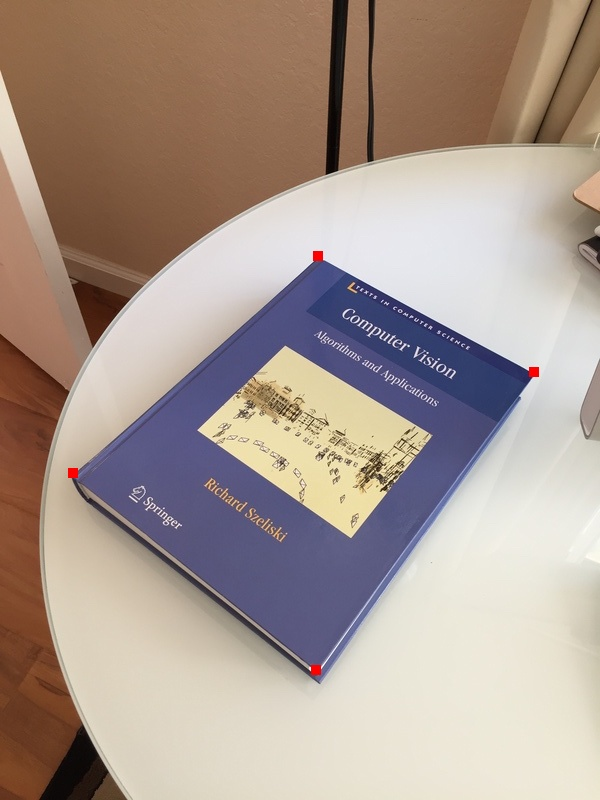
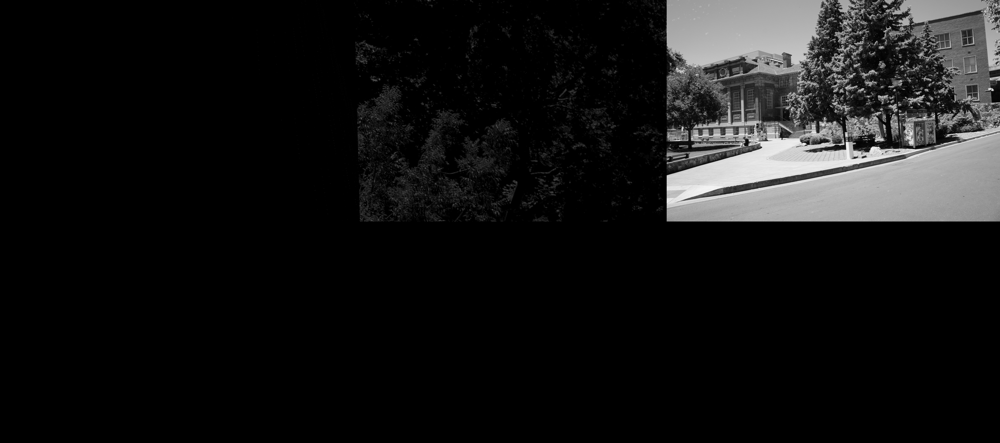

# **Assignment 2: Warping, Matching, Stitching, Blending**
Completed by: Brad Cooley (bwcooley@iu.edu), Arpan Ojha (arojha@iu.edu), Noah Mobley (njmobley@iu.edu)

### _Opening Remarks_

This project consisted of three parts found in this [project description document](/a2.pdf) with our group's implementation documented in a report-style format below.

_The code in this project is not perfect and optimizations can always be found. I would love to have a discussion about potential optimizations! Feel free to contact me (Brad Cooley) at my IU email above._

## **Problem 1**
_Implemented by Noah Mobley_

### _How the code works_

The code for this problem is relatively simply and only two main functions are of particular note. The first interesting function was `count_matching_features()`.

This function accepted the ORB descriptors that was computed by CV2 library and then used a brute force method that finds the nearest two descriptors of the query image compared to the image we are currently observing. We only needed to find the two largest values since we performed the ratio test against every match that was found. For every match we calculated the ratio of E1/E2 and compared it to some threshold Tau. If the ratio was beneath the threshold then we added a 1 to the similarity score. The similarity score was scored out of 1000 and returned as a decimal. This is because we needed the diagonal values all scaled to 1 to meet the criteria of an affinity matrix.

The next interesting function is the spectral clustering function. All though Scikit-learn does a lot of the work for us. The clustering process works much like Knn however when processing the matrix we only have a pairwise similarity matrix. To make the data suitable for KNN the data is first embedded into a lower dimensional space. This works by taking the eigen decomposition of the similarity matrix and projecting each data point into a d-dimmensional representation, where d is selected but typically the number of clusters.

The last two functions simply accept the estimated clusters and put each cluster on their own line and then write the output.

### _Performance_

The beneficial part of this process is that we only have 1 hyper parameter to tune. This parameter was the tau threshold for the ratio test. Below is a graph of how well the accuracy was varying the threshold.

Although lower thresholds seem to be very sensitive, which could have been because of the randomness associate with spectral clustering. We eventually plateau around 85% accuracy with thresholds between .8-.9 being around the optimal spot. We can see that if we have images with too low of a threshold then there are little to no matches as for the bottom comparison we don't get a single match until we have a threshold of .6:

For Threshold for .85 we see that we now have a reasonable number of features matching:

And once we let the threshold be very high to .95 almost too many things that just happen to be a little similar become a match:

So it was important for us to take the time to run experiments to get the proper value has even a difference of .1 can make a drastic difference in performance.

### _Problems with our clustering_

We only achieved 15% accuracy for pairwise accuracy meaning that 15% of the pairs were not identified correctly. To look at an example of a False negative we had the these two pictures of the Colosseum.

And in contract here is an example of a False positive with the same Colosseum and the Eiffel Tower.

We can see that the grid like structure of the eiffel tower seemed to match with the arches of the Colosseum. This is because the angle the Colosseum was taken at makes the arches overlap more giving a more grid like structure.

If we point our attention to the False negative we received and see that The image on the left doesn't lok to have nearly as much of a grid structure. This is because the arches were taken at a much more straight on angle. This is one issue we can have is that it is difficult to capture the depth of images and when images are taken at such different angles it can cause this altered vision.

We can look at another false positive this time between the London Eye and Notre Dame Cathedral

What is interesting here is that most of the matches happen to come from the area where the edges of the building or the wheel are intersecting the sky. This is another problem with our program it seems that if the image have very similar background then images will get matches that we weren't expecting. This will happen when images have very generic backgrounds, like the sky or an ocean would be another background that could cause unwanted matches.

## **Problem 2**
_Implemented by Brad Cooley_

### _How the code works_

The code for this problem was built in an iterative approach and then refined after completing all the parts. I started with very verbose code for solving the systems of equations for the **translation** and **Euclidean transformation**. Nicholas helped me out here by creating a visual marking system to mark inputted points on their respective images and then saving those images. This was very helpful in the refinement and development of the rest of the problem. From there, I solved the projective transformation as I understood the concept a lot better than the affine transformation. Once I had solved the projective transformation, I reused the general framework to solve the affine transformation as it only dealt with two less parameters.

All the transformations were contained in a singular function that generated the specific transformation matrix depending on the number of points given. The application of the transformation matrix on the given images and points was also contained in its own function. From there, the main function handled the input and the invocation of said functions.

### _Performance_

The code performs fairly efficiently. I'm sure there are some optimizations that can be done, but the reason it doesn't perform instantaneously is because it iterates over the images pixel by pixel. Nevertheless, it still is a good implementation.

### _Results_

#### _Lincoln Memorial Picture (Part 1)_

This was just to show a projective transformation could be done given a single image and a transformation matrix.

#### _Translation_

With the parameter `n = 1` and a single point in each image, we could perform a simple translation, like so:

#### _Euclidean Transformation_

With the parameter `n = 2` and two points in each image, we could perform an Euclidean Transformation, like so:

#### _Affine Transformation_

With the parameter `n = 3` and two points in each image, we could perform an Affine Transformation, like so:

#### _Projective Transformation_

With the parameter `n = 4` and two points in each image, we could perform a Projective Transformation, like so:

#### _Debugging / Visual Aid_

This is the result of the function Nicholas wrote to help visualize what points were inputted to the program.

### _Problems / Setbacks_

Originally, I wrote the transformation code in `C++` and after realizing my partners wrote their solutions in `Python`, I realized we had somewhat of an issue on our hands. I wasn't super far along in my `C++` implementation, so I switched over to `Python`.

The biggest issue that I had was getting the bilinear interpolation to work. I couldn't figure this part out, so we went with a nearest neighbor (rounding) solution that still produced good results.

### _Final Comments_

This was definitely a challenging part of the assignment, but starting with the simplest transformation allowed me to see how they are all connected in a practical sense. From there, it was easier to refine and build off what I had already done.

## **Part 3**
_Implemented by Arpan Ojha_

This was by far the most challenging idea:
Initially we thought of combining code from part 1 and 2 and use the idea of transformations to figure out missing points.

Steps of part3.py are as follows:
1. Calculate matching descriptors
2. Calculate good key points
3. Obtain the transformation matrix using RANSAC
4. Once we have two images of roughly similar camera angle (after transformation), use translational geometry to combine them.
We had few decent results:  

There were a lot of disasters like:

This experiment did not yield the best results and remains our best individual efforts.  This is due to the following possible reasons:  

- Transformations are remarkable in terms of moving perspectives. however if we use this alone for stitching, even with RANSAC there are a lot of errors expected. It is only ideal for landscape type stitching of vertical stitching. Other types of stitching will cause issues with rotation and shear.
- If it were just translating points this method is fine, however when translating many points all of which are error prone could cause problems identifying the proper transformation matrix.  

After some digging we came across a paper that did the panoramic stitching of two images using the same first three steps however it used a different blending technique. This code is partly obtained from [this GitHub repo](https://github.com/varunjain3/PanoramaStitching/blob/master/mywarp.py).  

## **Contributions**

**Nicholas Mobley** worked on Problem 1 and completed it in it's entirety.

**Brad Cooley** worked on Problem 2 and completed it in it's entirety with help from Nicholas (translation and `apply_transformation` function).

**Arpan Ojha** worked on Problem 3. I developed parts needed for part 3 i.e. part 1 and 2 independently.

For part 3 I referred to [this paper](https://link.springer.com/article/10.1007/s11263-006-0002-3).
